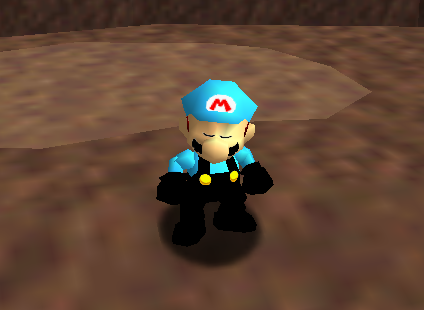

# OlaiaWorld
a mod for sm64ex-coop-coop!, enjoy.
# How to install
Install tools from tools folder, download the sm64ex-coop-coop repo, extract the zip and drop the folder "olaiaworld" in sm64ex-coop-coop/mods (if you want to use the mod with a compiled version then drop the folder in sm64ex-coop-coop/build/us_pc/mods, and the other thing to do is optional), compile with external data then done!
# Developer
JustOlaia#1043
# Credits
CJRed for the skin swapper mod where i created this mod and Hatkid mod for the old moveset (and for the almost released glitchy olaiaworld)
# Whats new?
23/05/2022: added incompatible tag, 23/05/2022: Created "README_es_ES.md" as a spanish translation

# Screenshots
 
   
